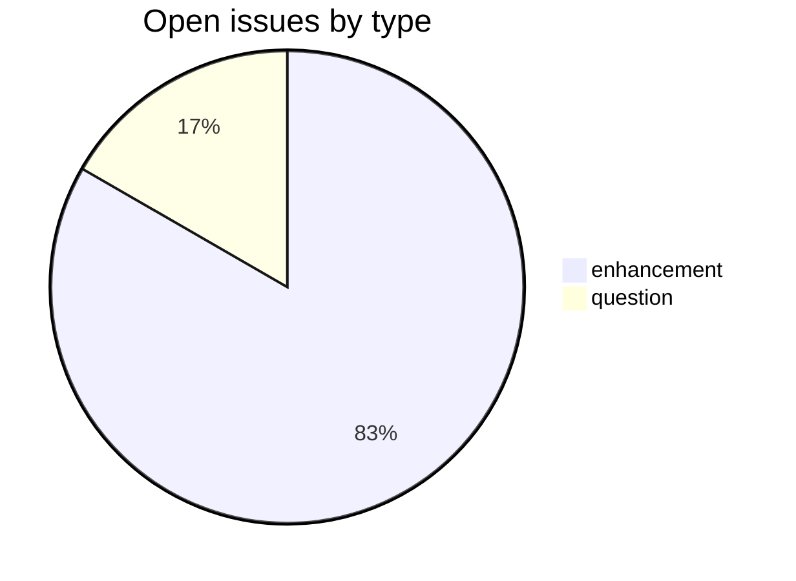
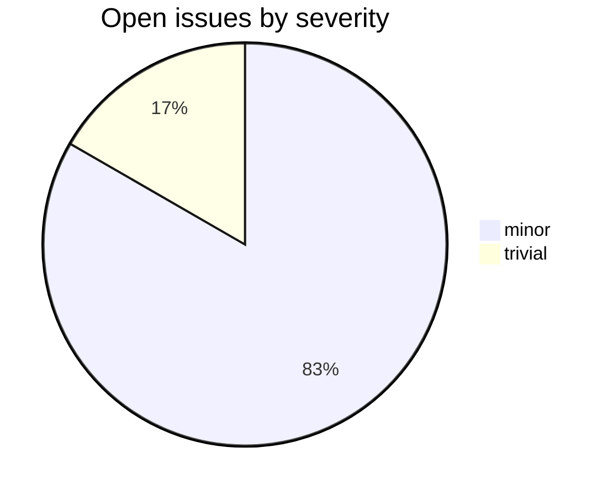

# MWinflect

CDSL **processing-tool** repository in the Sanskrit Lexicon project.
Generates declensions and conjugations for words in the MW1899 dictionary.

## Tech Stack

- **Runtime**: Python 3
- **Build**: plain `python` scripts (no packaging yet)
- **Input**: MW1899 dictionary entries (sourced from `csl-orig`)
- **Output**: declension / conjugation tables per stem model

## Issues Overview

**Total**: 48 | **Open**: 48 | **Closed**: 0

### By Milestone

| Milestone | Open | Closed | Total |
|---|---:|---:|---:|
| API Stability | 0 | 0 | 0 |
| User Experience | 40 | 0 | 40 |
| Data Quality | 0 | 0 | 0 |
| Developer Experience | 0 | 0 | 0 |
| Community | 8 | 0 | 8 |

### By Type

### By Severity

## GitHub Issue Conventions

Follows the [Cologne tooling-repo taxonomy](https://github.com/sanskrit-lexicon/csl-observatory/blob/main/runbook/cologne-tooling-runbook.md):

- **17 type labels** across 5 categories (code quality, features, docs, infra, research)
- **4 severity levels**: trivial, minor, major, critical
- **5 milestones**: API Stability, User Experience, Data Quality, Developer Experience, Community
- **Domain labels** scoped to processing-tool: `domain:morphology`, `domain:normalization`, `domain:lookup`
- **Org Project**: [Tooling Roadmap](https://github.com/orgs/sanskrit-lexicon/projects/9)

See [CLAUDE.md](CLAUDE.md) for full definitions.

---
*Generated by Cologne Tooling Runbook on 2026-05-29*

## License

This repository contains both source code and dictionary/data files, which are
licensed separately:

- **Source code** (e.g. `*.py`, `*.php`, `*.js`, `*.sh`) is licensed under the
  **GNU General Public License v3.0** — see [`LICENSE-CODE`](LICENSE-CODE).
- **Dictionary and data files** are licensed under **Creative Commons
  Attribution-ShareAlike 4.0 International (CC-BY-SA-4.0)** — see
  [`LICENSE`](LICENSE).
